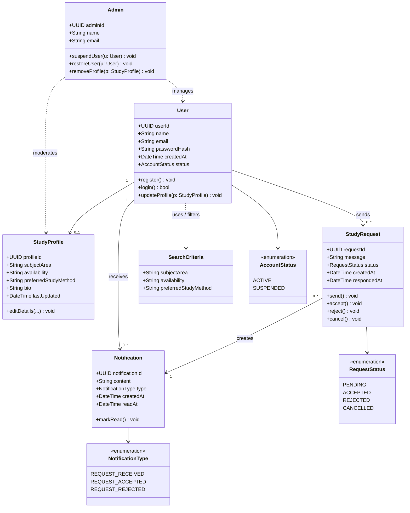

# Study Matching System - Class Diagram

```mermaid
classDiagram

class Admin {
  +UUID adminId
  +String name
  +String email
  +suspendUser(u: User) void
  +restoreUser(u: User) void
  +removeProfile(p: StudyProfile) void
}

class User {
  +UUID userId
  +String name
  +String email
  +String passwordHash
  +DateTime createdAt
  +AccountStatus status
  +register() void
  +login() bool
  +updateProfile(p: StudyProfile) void
}

class StudyProfile {
  +UUID profileId
  +String subjectArea
  +String availability
  +String preferredStudyMethod
  +String bio
  +DateTime lastUpdated
  +editDetails(...) void
}

class StudyRequest {
  +UUID requestId
  +String message
  +RequestStatus status
  +DateTime createdAt
  +DateTime respondedAt
  +send() void
  +accept() void
  +reject() void
  +cancel() void
}

class Notification {
  +UUID notificationId
  +String content
  +NotificationType type
  +DateTime createdAt
  +DateTime readAt
  +markRead() void
}

class SearchCriteria {
  +String subjectArea
  +String availability
  +String preferredStudyMethod
}

class NotificationType {
  <<enumeration>>
  REQUEST_RECEIVED
  REQUEST_ACCEPTED
  REQUEST_REJECTED
}

class RequestStatus {
  <<enumeration>>
  PENDING
  ACCEPTED
  REJECTED
  CANCELLED
}

class AccountStatus {
  <<enumeration>>
  ACTIVE
  SUSPENDED
}

Admin ..> User : manages
Admin ..> StudyProfile : moderates

User "1" --> "0..1" StudyProfile
User "1" --> "0..*" StudyRequest : sends
StudyRequest --> RequestStatus
User "1" --> "0..*" Notification : receives
StudyRequest "0..*" --> "1" Notification : creates

User ..> SearchCriteria : uses / filters

User --> AccountStatus
Notification --> NotificationType

```