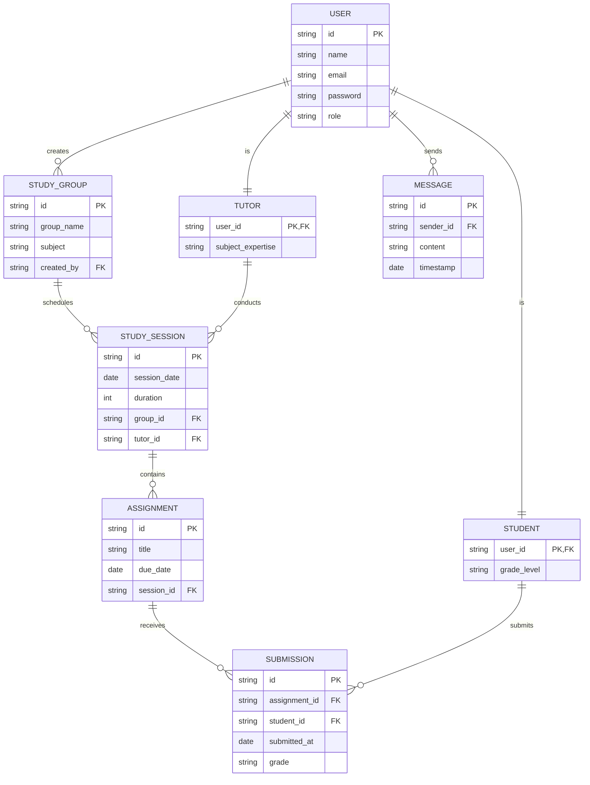

# StudyBuddy App – ER Diagram

```mermaid
erDiagram

    USER {
        string id PK
        string name
        string email
        string password
        string role
    }

    STUDENT {
        string user_id PK, FK
        string grade_level
    }

    TUTOR {
        string user_id PK, FK
        string subject_expertise
    }

    STUDY_GROUP {
        string id PK
        string group_name
        string subject
        string created_by FK
    }

    STUDY_SESSION {
        string id PK
        date session_date
        int duration
        string group_id FK
        string tutor_id FK
    }

    ASSIGNMENT {
        string id PK
        string title
        date due_date
        string session_id FK
    }

    SUBMISSION {
        string id PK
        string assignment_id FK
        string student_id FK
        date submitted_at
        string grade
    }

    MESSAGE {
        string id PK
        string sender_id FK
        string content
        date timestamp
    }

    USER ||--|| STUDENT : is
    USER ||--|| TUTOR : is
    USER ||--o{ STUDY_GROUP : creates
    STUDY_GROUP ||--o{ STUDY_SESSION : schedules
    TUTOR ||--o{ STUDY_SESSION : conducts
    STUDY_SESSION ||--o{ ASSIGNMENT : contains
    ASSIGNMENT ||--o{ SUBMISSION : receives
    STUDENT ||--o{ SUBMISSION : submits
    USER ||--o{ MESSAGE : sends
```
