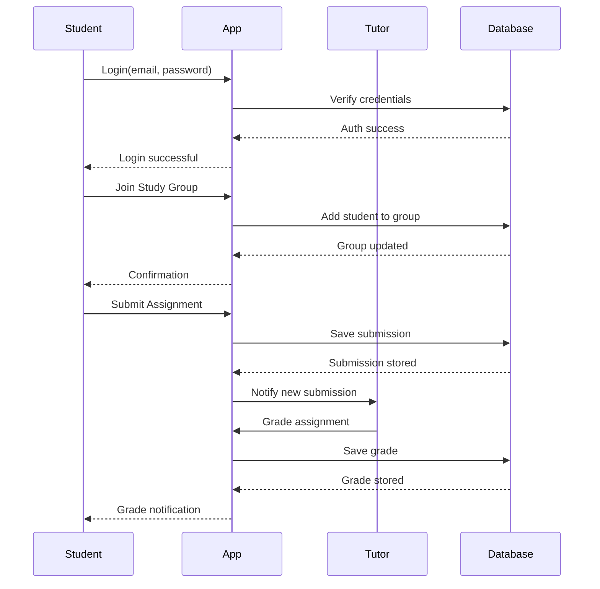

# StudyBuddy App – Sequence Diagram

```mermaid
sequenceDiagram
    participant Student
    participant App
    participant Tutor
    participant Database

    Student->>App: Login(email, password)
    App->>Database: Verify credentials
    Database-->>App: Auth success
    App-->>Student: Login successful

    Student->>App: Join Study Group
    App->>Database: Add student to group
    Database-->>App: Group updated
    App-->>Student: Confirmation

    Student->>App: Submit Assignment
    App->>Database: Save submission
    Database-->>App: Submission stored

    App->>Tutor: Notify new submission
    Tutor->>App: Grade assignment
    App->>Database: Save grade
    Database-->>App: Grade stored
    App-->>Student: Grade notification
```
