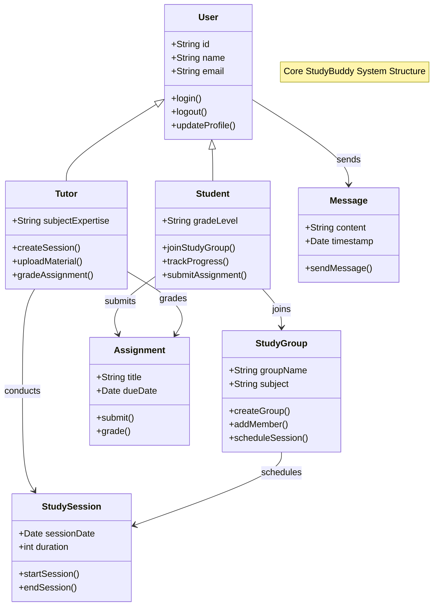

# StudyBuddy App – Class Diagram

```mermaid
classDiagram
    note "Core StudyBuddy System Structure"

    User <|-- Student
    User <|-- Tutor

    class User{
        +String id
        +String name
        +String email
        +login()
        +logout()
        +updateProfile()
    }

    class Student{
        +String gradeLevel
        +joinStudyGroup()
        +trackProgress()
        +submitAssignment()
    }

    class Tutor{
        +String subjectExpertise
        +createSession()
        +uploadMaterial()
        +gradeAssignment()
    }

    class StudyGroup{
        +String groupName
        +String subject
        +createGroup()
        +addMember()
        +scheduleSession()
    }

    class StudySession{
        +Date sessionDate
        +int duration
        +startSession()
        +endSession()
    }

    class Assignment{
        +String title
        +Date dueDate
        +submit()
        +grade()
    }

    class Message{
        +String content
        +Date timestamp
        +sendMessage()
    }

    Student --> StudyGroup : joins
    Tutor --> StudySession : conducts
    StudyGroup --> StudySession : schedules
    Student --> Assignment : submits
    Tutor --> Assignment : grades
    User --> Message : sends
```
