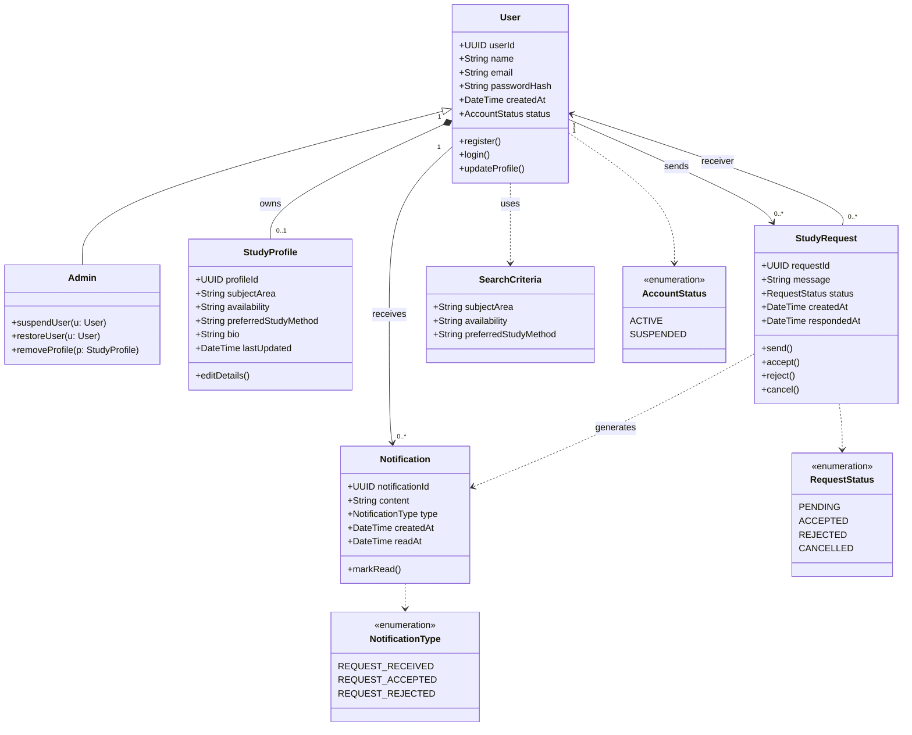
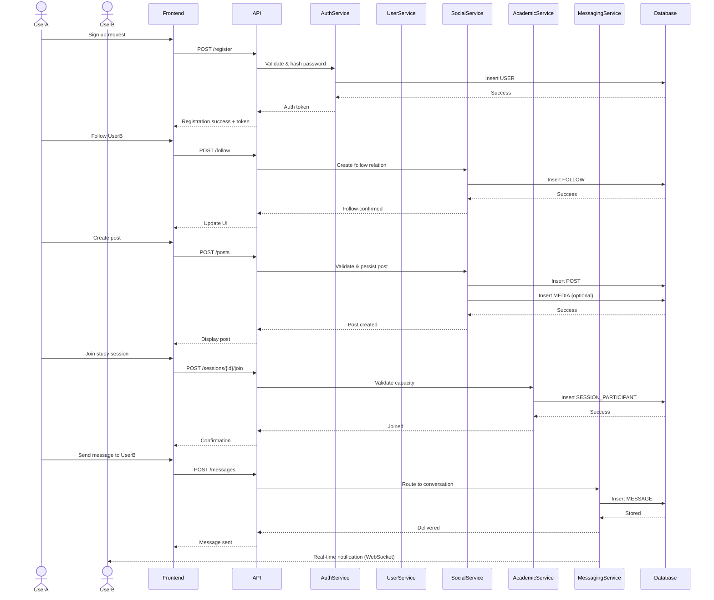
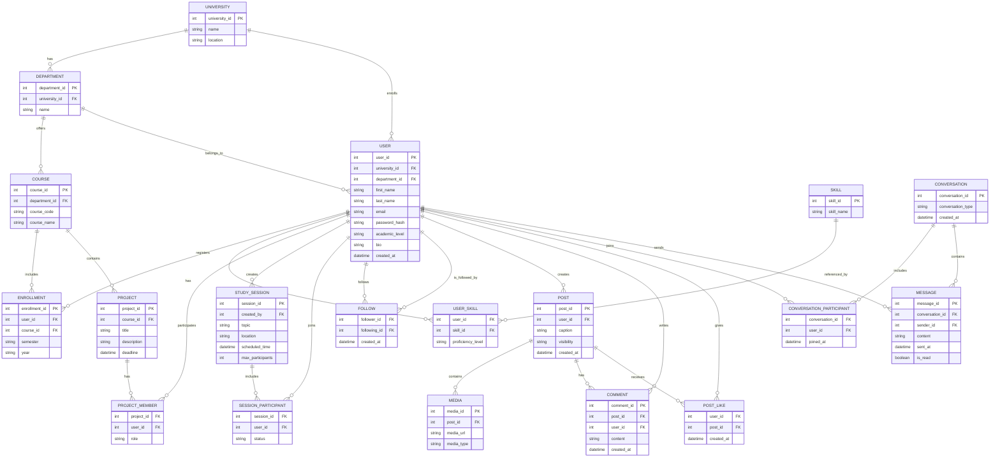

# StudyBuddy: Software Engineering Project Report

## Group Details
**Group Name:** Group 777
**Group Members:**
- Ali Ganji (Z23599848)
- Nilay Oral (Z23607537)
- Leilani Grogan-Mowatt (A00019111)
- Maywon Niazi (Z22525705)
- Tavishi Lamba (A00019627)

---

## 1. Project Description
Study buddies is a group software engineering project designed to support university students in organising their study activities, connecting with peers, and improving collaboration and wellbeing. Users can create an account in order to find other people to study or chat with based on a variety of categories, such as the type of course a user is studying or what kind of person they would like to study with. Users can send chat requests to study together, search for people via different filtering categories, and provide ratings for people they have studied with.

---

## 2. Team Code of Conduct
To support a productive and respectful working environment, our team agrees to follow the principles outlined below.

### Communication Standards
- Communicate clearly, respectfully, and professionally with all team members.
- Ensure that everyone has the chance to share ideas, raise concerns, and give feedback.
- Reply to messages and emails from teammates within a 24 hour period.

### Teamwork and Collaboration
- Contribute fairly to group work and support one another in completing tasks.
- Take responsibility for individual duties while holding each other accountable as a team.
- Show flexibility and understanding toward the different commitments and circumstances of team members.

### Compliance with Rules and Policies
- Follow all project-related rules and expectations outlined in this document and elsewhere.
- Act in accordance with University policies and academic regulations at all times.

### Attendance, Availability & Exceptional Circumstances
- All team members are expected to attend scheduled lectures, labs, sprint reviews, and group presentations.
- The affected team member must inform the group as early as possible (at least 12 hours in advance).
- Notification should be made via WhatsApp.

### Managing Non-Compliance
- Continued absence without prior communication may be reported to the module tutor.
- Ongoing failure to complete assigned tasks will be discussed as a group.

---

## 3. Scrum Practices
1. **Sprint Planning:** Every timetabled lesson or whenever requested, the team will meet to decide which tasks will be completed.
2. **Sprint Review:** At the end of each sprint, the team will review work, gather feedback, and identify improvements.
3. **Daily Stand-ups:** Weekly meetings focusing on completed work and current challenges.

### Roles and Responsibilities
- **Scrum Master:** Coordinate and guide the Scrum process. Regularly check progress and address obstacles.
- **Project Owner:** Manage and prioritize the project backlog. Communicate the project vision and objectives.

---

## 4. Ethical Issues
StudyBuddy is designed to be ethically grounded and aligned with professional standards.

### 4.1 Data Privacy and Protection
- **Data Minimisation:** Collect only what is necessary.
- **Purpose Limitation:** Use data only for stated purposes.
- **Integrity and Confidentiality:** Implement secure storage and transport security.

### 4.2 Informed Consent
- Users must understand what data is collected, how matching works, and how to delete accounts.

### 4.3 Security and Secure Engineering
- Mitigation of SQL injection, unauthorized access, and credential exposure via strong hashing and environment variable management.

### 4.4 User Safety and Moderation
- Incorporation of reporting mechanisms, blocking features, and a clear Code of Conduct to prevent harassment.

---

## 5. User Stories
- **US1 – Create profile:** Create a profile with course, year, and modules.
- **US2 – Login to account:** Secure profile and activity.
- **US3 – Search by module:** Find someone studying the same subject.
- **US4 – View user profiles:** Decide if a student is a good match.
- **US5 – Send study request:** Organise a study session.
- **US6 – Accept or decline requests:** Control who you study with.
- **US7 – Dashboard:** See upcoming sessions and pending requests.
- **US8 – Filter by availability:** Find someone free at similar times.
- **US9 – Ratings and feedback:** Leave feedback after a session.
- **US10 – Report or block a user:** Safety against inappropriate behavior.

---

## 6. Diagrams

### 6.1 Class Diagram (Mermaid)

### 6.2 Sequence Diagram (Mermaid)

### 6.3 ER Diagram (Mermaid)

### 6.4 Design Diagrams (Images)
- **Use Case Diagram:** 
- **Activity Diagram:** 
- **System Flowchart:** 

---

## 7. Project Links
- **GitHub Repository:** [Z23599848/SoftwareEngineering](https://github.com/Z23599848/SoftwareEngineering)
- **Task Board:** [GitHub Project 2](https://github.com/users/Z23599848/projects/2)
- **Meeting Records:** [Meetings Folder](https://github.com/Z23599848/SoftwareEngineering/tree/main/meetings)
